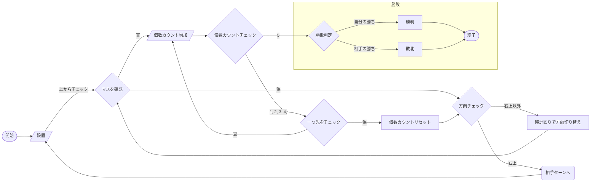
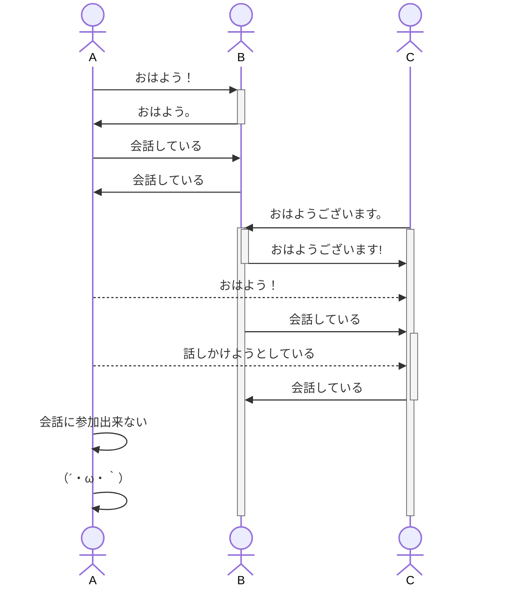
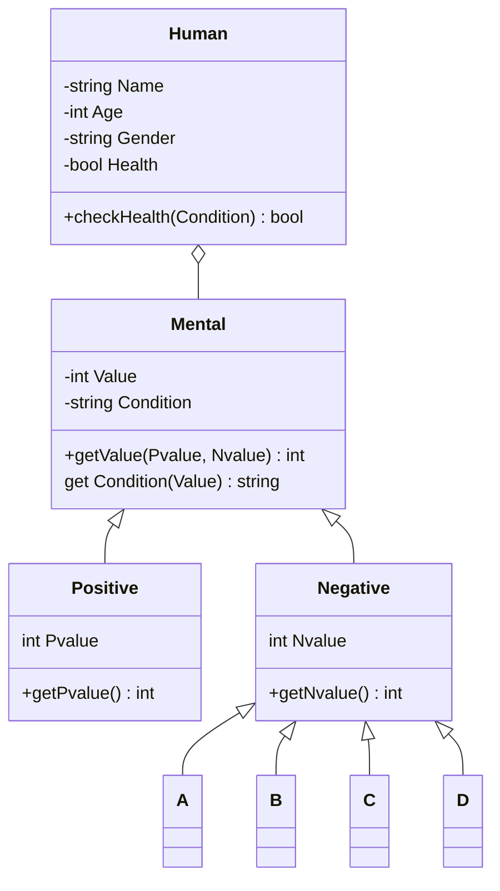

# 課題
Mermaidを触ってみよう

マークダウンファイルを編集して、Mermaidで図を描いてみよう

# 取り組み方
* 本プロジェクトをforkしてください。
* README.mdを編集して、Mermaidを使いこなしてください
* できたらプルリクエストを出します

# 課題項目
## 流れ図
### 解答
- 五目並べの判定文

## シーケンス図
### 解答
- 辛い現実

## クラス図
### 解答
- 人間

