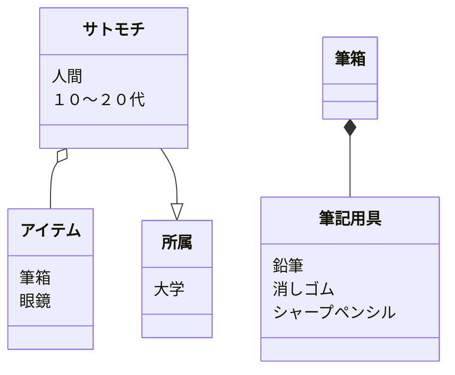

# 課題
Mermaidを触ってみよう

マークダウンファイルを編集して、Mermaidで図を描いてみよう

# 取り組み方
* 本プロジェクトをforkしてください。
* README.mdを編集して、Mermaidを使いこなしてください
* できたらプルリクエストを出します

# 課題項目
## 流れ図
### 条件
- 開始と終了ノードをつける
- 条件分岐を組み込む
- 5ノード以上
- カッコいいほど高得点

## 解答


## シーケンス図
### 条件
- 3人以上
- メッセージをやり取りしない人がいないように
- 自己呼び出しを含むこと
- カッコいいほど高得点

## 解答
```mermaid
sequenceDiagram
    actor M郎
    actor U郎
    acter K郎
    M郎->>+U郎:おはよう！
    activate U郎
    U郎-->>-M郎:おはよお～
    activate K郎
    K郎->>+U郎:おはようございまーす！
    activate U郎
    U郎-->>-K郎:おはよお～
    M郎->>+K郎:おはよう！
    activate K郎
    K郎-->>-K郎:おはようございまーす！
    M郎->>+U郎:Uちゃん、最近何やった？俺、鬼退治！
    detivate M郎
    activate U郎
    U郎-->>-M郎:僕はカメさんに乗って釣りしてたよ～
    detivate U郎
    activate M郎
    M郎->>+K郎:Kちゃんは最近何やった？
    detivate M郎
    activate K郎
    K郎-->>-M郎:山の動物たちと相撲してた！
```

## クラス図

### 条件
- 3つ以上
- 汎化と集約を含むこと
- カッコいいほど高得点

## 解答

