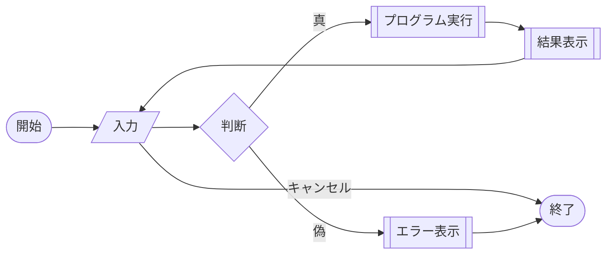
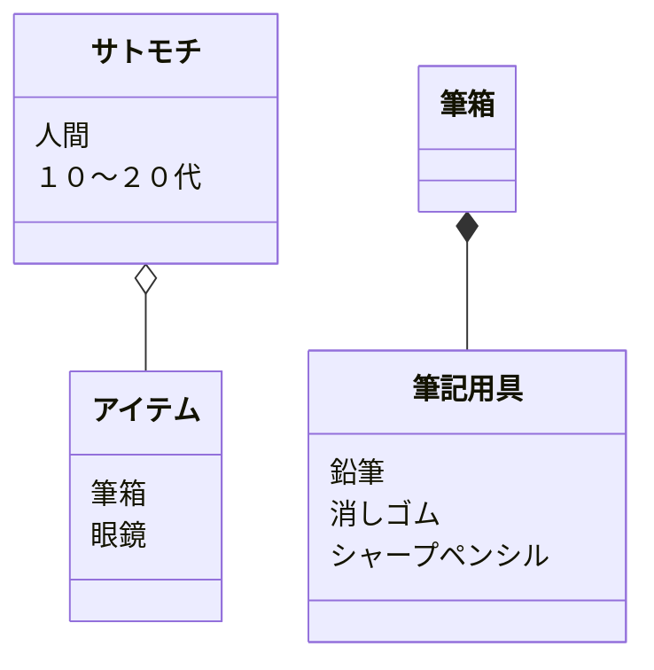

# 課題
Mermaidを触ってみよう

マークダウンファイルを編集して、Mermaidで図を描いてみよう

# 取り組み方
* 本プロジェクトをforkしてください。
* README.mdを編集して、Mermaidを使いこなしてください
* できたらプルリクエストを出します

# 課題項目
## 流れ図
### 条件
- 開始と終了ノードをつける
- 条件分岐を組み込む
- 5ノード以上
- カッコいいほど高得点

## 解答


## シーケンス図
### 条件
- 3人以上
- メッセージをやり取りしない人がいないように
- 自己呼び出しを含むこと
- カッコいいほど高得点

## 解答
```mermaid
sequenceDiagram
    actor 太郎
    actor 花子
    acter サトモチ
    太郎->>花子: おはよう！
    activate 花子
    花子-->>太郎: おはようございます!
    deactivate 花子
    太郎->>サトモチ: おはよう！
    activate サトモチ
    サトモチ -->>太郎: おはよ～
    deactivate サトモチ
    太郎->>花子: 今どんな気分？
    loop 今日の気分
    　　花子->>花子: ハッピーな気分！
    end
    花子-->>太郎:機嫌がいいよ！
    花子->>サトモチ: 今どんな気分？
    loop 今日の気分
    　　サトモチ->>サトモチ: 疲れてる
    end
    サトモチ-->>花子:ベットに転がりたい気分 
```

## クラス図

### 条件
- 3つ以上
- 汎化と集約を含むこと
- カッコいいほど高得点

## 解答

