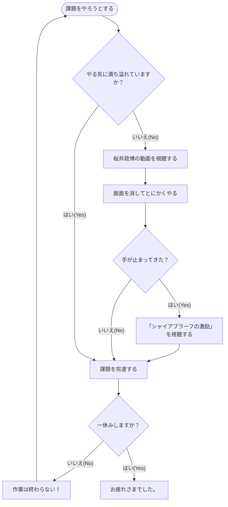
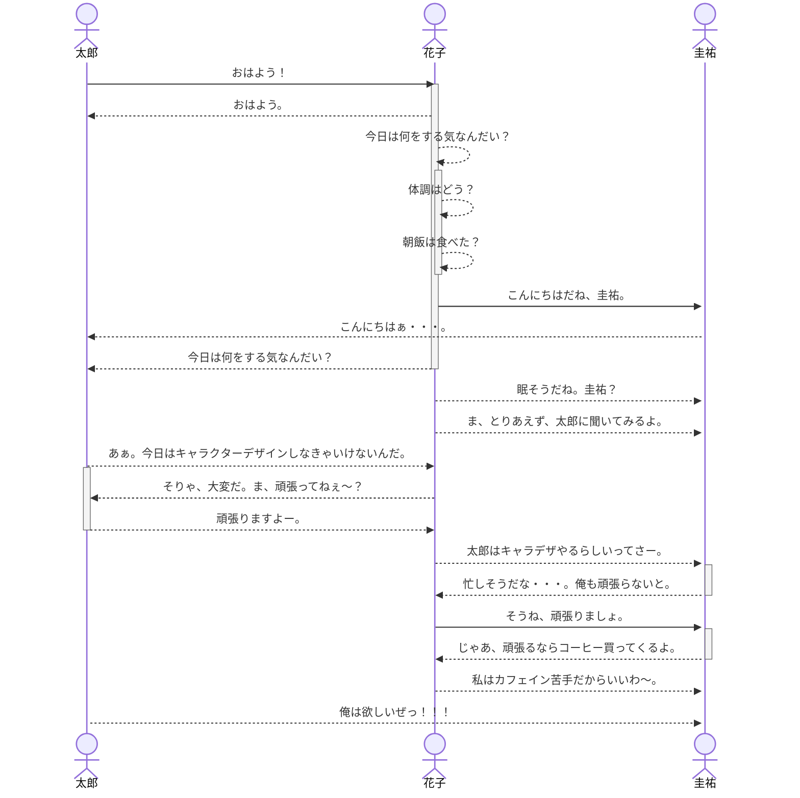
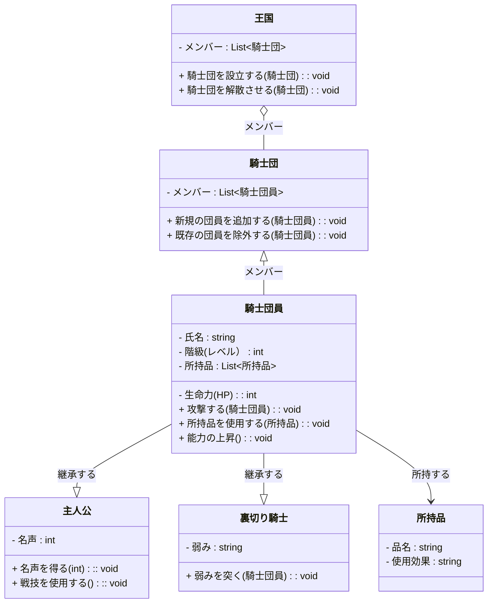

# 課題
Mermaidを触ってみよう

マークダウンファイルを編集して、Mermaidで図を描いてみよう

# 取り組み方
* 本プロジェクトをforkしてください。
* README.mdを編集して、Mermaidを使いこなしてください
* できたらプルリクエストを出します

# 課題項目
## 流れ図
### 条件
- 開始と終了ノードをつける
- 条件分岐を組み込む
- 5ノード以上
- カッコいいほど高得点

## 解答

## シーケンス図
### 条件
- 3人以上
- メッセージをやり取りしない人がいないように
- 自己呼び出しを含むこと
- カッコいいほど高得点

## 解答

## クラス図

### 条件
- 3つ以上
- 汎化と集約を含むこと
- カッコいいほど高得点

## 解答

