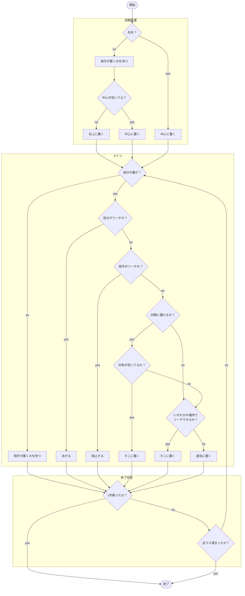
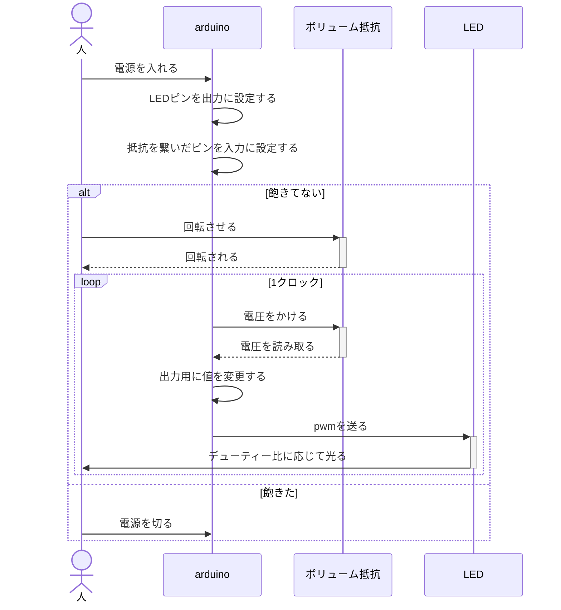
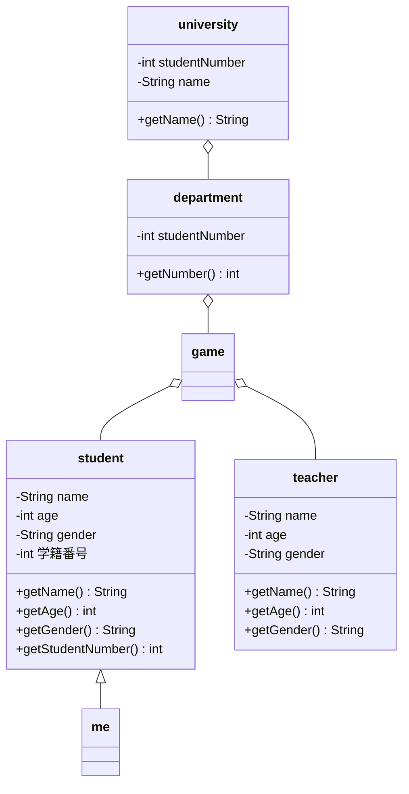

test mermaid

# 流れ図
- 三目ならべの最善手

```mermaid
flowchart TD;
start([開始]) --> Q1{"先手？"};

subgraph "初期配置"
  Q1 -- yes --> f1[中心に置く];
  Q1 -- no --> f2[相手が置くのを待つ];
  f2 --> Q2{"中心が空いてる？"};
  Q2 -- yes --> f3[中心に置く];
  Q2 -- no --> f4[右上に置く];
end

f4 --> Q3{"自分の番か？"};
f3 --> Q3;
f1 --> Q3;

subgraph "メイン"
  Q3 -- no --> m1[相手が置くのを待つ];
  
  Q3 -- yes --> Q4{"自分がリーチか？"};
  Q4 -- yes --> m2[あがる];
  Q4 -- no --> Q5{"相手がリーチか？"};
  Q5 -- yes --> m3[阻止する];
  
  Q5 -- no --> Q6{"四隅に置けるか？"};
  Q6 -- yes --> Q7{"対角が空いてるか？"};
  Q7 -- yes --> m4[そこに置く];
  
  Q6 -- no --> Q8{"いずれかの場所で
                   リーチできるか？"};
  Q7 -- no --> Q8;
  
  Q8 -- yes --> m5[そこに置く];
  Q8 -- no --> m6[適当に置く];
end

m1 --> Q9{"1列揃ったか？"};
m2 --> Q9;
m3 --> Q9;
m4 --> Q9;
m5 --> Q9;
m6 --> Q9;

subgraph "終了判定"
  Q9 -- no --> Q10{"全マス埋まったか？"};
  Q10 -- no --> Q3;
end

Q9 -- yes --> finish([終了])
Q10 -- yes --> finish;
```

# シーケンス図
- arduinoでボリューム抵抗を使いLEDの明るさを変更する

```mermaid
sequenceDiagram

  actor human as 人
  participant arduino
  participant R as ボリューム抵抗
  participant LED
  
  human->>arduino: 電源を入れる
  arduino->>arduino: LEDピンを出力に設定する
  arduino->>arduino: 抵抗を繋いだピンを入力に設定する
  alt 飽きてない
    human->>+R: 回転させる
    R-->>-human: 回転される
    loop 1クロック
      arduino->>+R: 電圧をかける
      R-->>-arduino: 電圧を読み取る
      arduino->>arduino: 出力用に値を変更する
      arduino->>+LED: pwmを送る
      LED->>-human: デューティー比に応じて光る
    end
  else 飽きた
    human->>arduino: 電源を切る
  end
  
```

# クラス図
- 大学内の自分

```mermaid
classDiagram
  class student {
    -String name
    -int age
    -String gender
    -int 学籍番号
    +getName() String
    +getAge() int
    +getGender() String
    +getStudentNumber() int
  }
  
  class me {
    
  }
  
  class teacher {
    -String name
    -int age
    -String gender
    +getName() String
    +getAge() int
    +getGender() String
  }
  
  class department {
    -int studentNumber
    +getNumber() int
  }
  
  class game {
    
  }
  
  class university {
    -int studentNumber
    -String name
    +getName() String
  }
  
  student <|-- me
  game o-- student
  game o-- teacher
  department o-- game
  university o-- department
  
```
